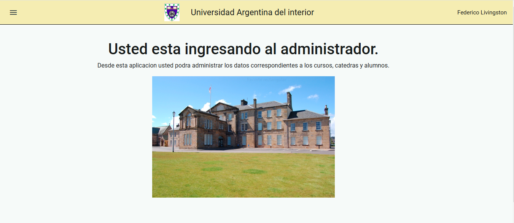

# Universidad Argentina del interior

Es el sitio de administracion de cursos, alumnos e inscripciones de la uneversidad.
El proyecto fue desarrollado con Angular, y Angular Materials, utilizando Json-Server como base de datos.

## Tecnologias utilizadas
     

## Descripción del Proyecto

La aplicacion esta desarrollada como spa (single page application), utilizando ReactJS como tecnologia principal, cuenta con un catalogo de productos, que en la home trae los productos designados como destacados creando una opcion para mostrar aquellos productos que se desea impulsar, luego la navegacion del mismo es por categoria.
Cada producto tiene un detalle que permite ver los datos completos y acceder a realizar el pedido del mismo ingresandolo al carrito.
El carrito de compras contiene la lista de productos ingresados y permite modificar la cantidad de los mismos, quitar uno o todos los productos agregados, o ir al checkout para finalizar la compra.
Finalmente el checkout solicita datos de facturacion y contacto para finalizar la compra registrando la orden, en caso de que al momento de generar la orden el stock de alguno de los productos solicitados no cubra el pedido, la orden se genera y se le comunica al cliente la situacion indicandole que se comunicaran con el para resolverlo.

### Instalacion

Para instalar la aplicacion clonar el repositorio y crear las variables de entorno que se especifican en el archivo sample_env.txt con los valores correspondientes.
